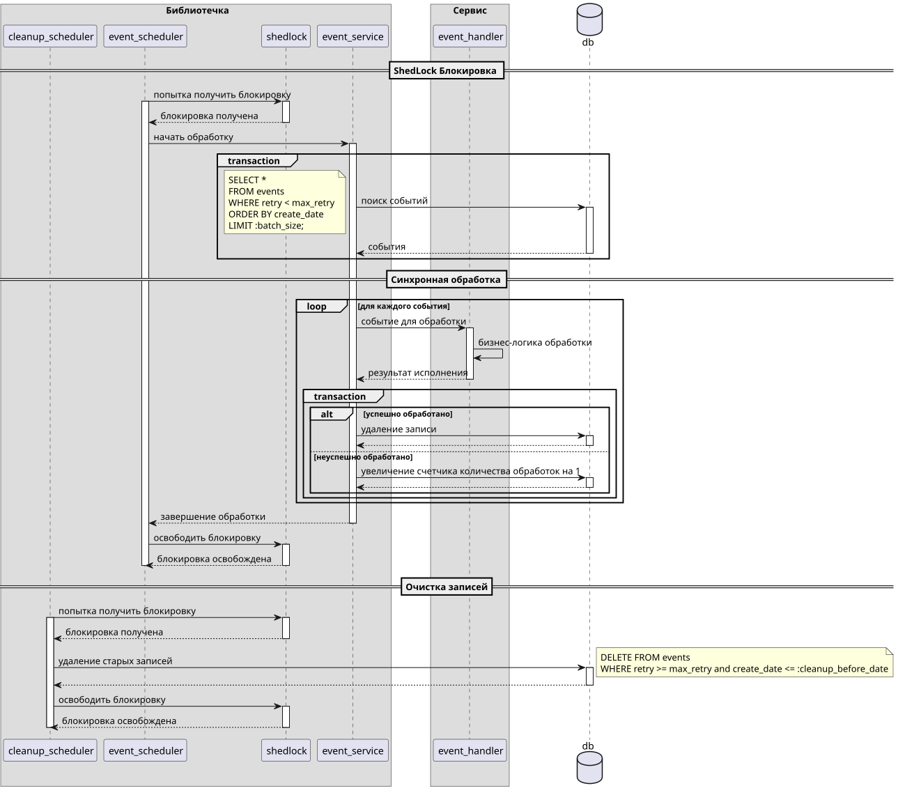
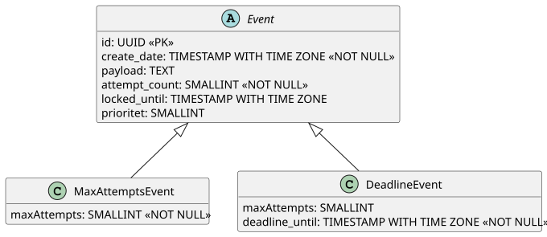
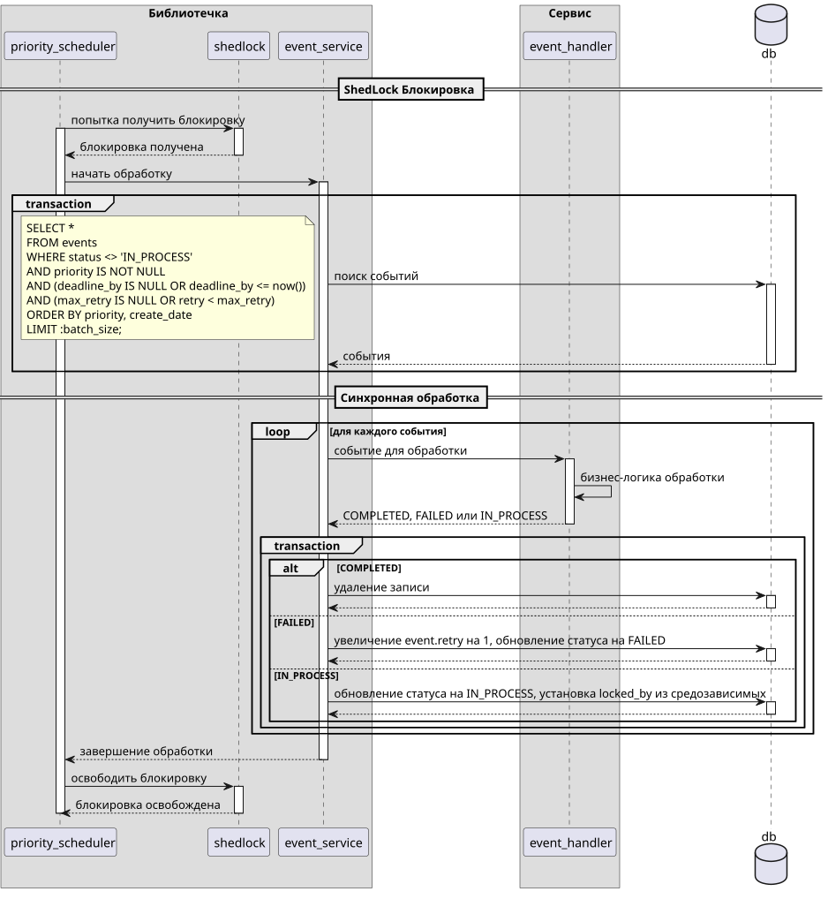
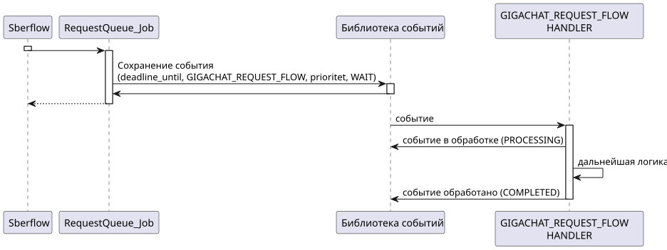

# AS IS

## Логическая модель event

| Поле          | Тип                                | Описание                                                                                |
| ------------- | ---------------------------------- | --------------------------------------------------------------------------------------- |
| id            | UUID, PK                           |                                                                                         |
| create_date   | TIMESTAMP WITH TIME ZONE, NOT NULL |                                                                                         |
| code          | VARCHAR(100), NOT NULL             | название события                                                                        |
| payload       | TEXT                               | payload для обработки                                                                   |
| group_id      | VARCHAR(100)                       | идентификатор группы в рамках, которого необходимо обрабатывать события последовательно |
| attempt_count | SMALLINT, NOT NULL                 | количество неудачных попыток обработки                                                  |
| max_attempts  | SMALLINT                           | максимальное количество неудачных попыток обработки                                     |

## Обработка

1. Поиск событий для обработки

```sql
SELECT *
FROM events
WHERE attempt_count < max_attempts
ORDER BY create_date
LIMIT :batch_size;
```

2. Сгруппировать события по `group_id` и каждую группу отсортировать по `create_date `
3. Для каждого события:
   1. Найти обработчик по `code`
   2. Передать на обработку событие
   3. Синхронно дождаться завершения обработки события
   4. Удалить событие по `id`
4. Если обработчик по `code` не найден
   1. установить `attempt_count` равным `max_attempts`
   2. Логирование, мониторинг
5. Если обработка события закончилась ошибкой
   1. увеличить `attempt_count` на 1
   2. Логирование, мониторинг (как финальных, так и нет попыток обработки)

## Очистка

1. Запрос для очистки старых записей

```sql
DELETE FROM events
WHERE attempt_count >= max_attempts and create_date <= :cleanup_before_date
```

## Общая схема



# TO BE (Доработки приоритетов и дедлайна обработки)

## Концептуальная модель event



## Логическая модель event

| Поле           | Тип                                | Описание                                                                                |
| -------------- | ---------------------------------- | --------------------------------------------------------------------------------------- |
| id             | UUID, PK                           |                                                                                         |
| create_date    | TIMESTAMP WITH TIME ZONE, NOT NULL |                                                                                         |
| code           | VARCHAR(100), NOT NULL             | название события                                                                        |
| payload        | TEXT                               | payload для обработки                                                                   |
| group_id       | VARCHAR(100)                       | идентификатор группы в рамках, которого необходимо обрабатывать события последовательно |
| attempt_count  | SMALLINT, NOT NULL                 | количество неудачных попыток обработки                                                  |
| max_attempts   | SMALLINT                           | максимальное количество неудачных попыток обработки                                     |
| deadline_until | TIMESTAMP WITH TIME ZONE           | Время дедлайна, когда событие становится просроченным                                   |
| locked_until   | TIMESTAMP WITH TIME ZONE           | Время блокировки события, после которого событие считается неуспешно обработанным       |
| prioritet      | SMALLINT                           | Приоритет события                                                                       |
| status         | VARCHAR(50)                        | Статусы события (WAIT, PROCESSING, ERROR)                                               |

## Добавление шедулера обработки событий по приоритетам



## Доработка запроса удаления старых событий в шедулере очистки

```sql
DELETE FROM events
WHERE (now() >= deadline_until OR attempt_count >= max_attempts) and create_date <= :cleanup_before_date
```

## Доработка запроса поиска событий без приоритетов

```sql
SELECT *
FROM events
WHERE status <> 'IN_PROCESS'
AND priority IS NULL
AND (deadline_until IS NULL OR deadline_until <= now())
AND (max_attempts IS NULL OR attempt_count < max_attempts)
ORDER BY create_date
LIMIT :batch_size;
```

## Логика IDR обработчика



## Задачи

- Обновить ER: добавить (deadline_until, locked_until, prioritet, status) и убрать NOT NULL с max_attempts
- Добавить новый priority шедулер
- Обновить шедулер удаления старых записей
- Добавить конфигурацию поля locked_until для событий (Опционально)
- Добавить конфигурацию количества потоков на отдельные обработчики событий (Опционально)
