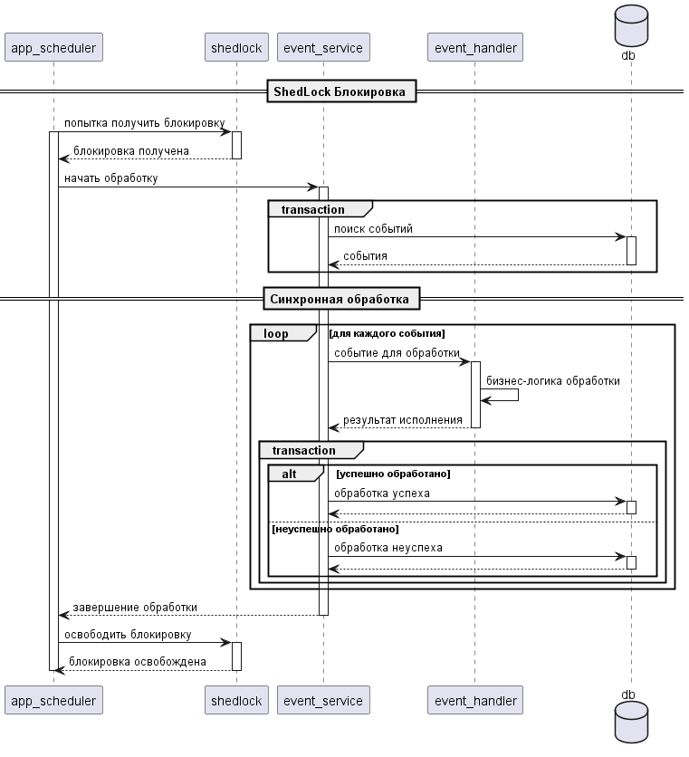
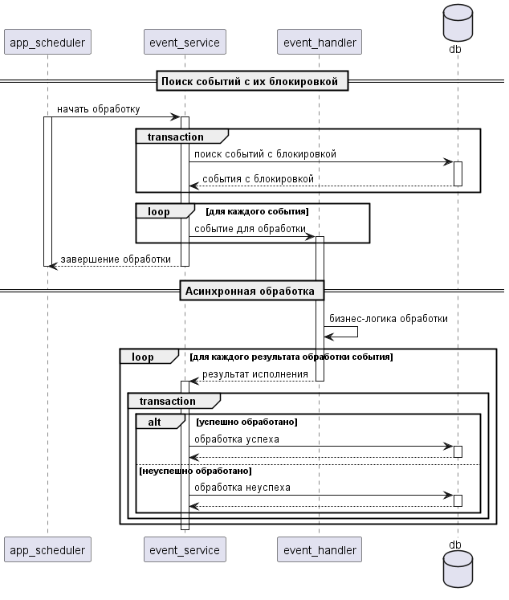
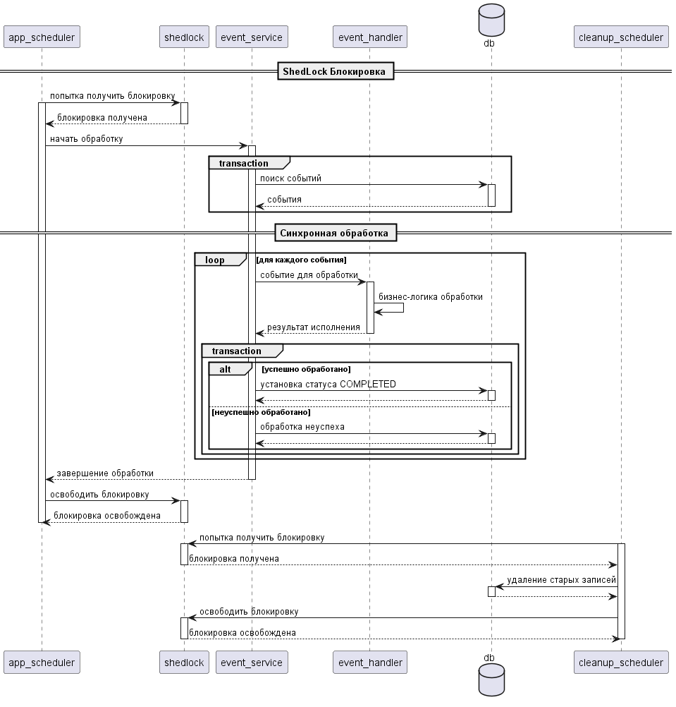

# Requirements
- Сохранение события для обработки **MUST**
    - Возможность с каждым событием сохранять кастомную полезную нагрузку для обработки события (Payload) **MUST**
    - Наличие у каждого события названия **MUST**
    - API для сохранения события **MUST**
- Обработка сохраненных событий **MUST**
    - API для реализации обработчиков событий по названиям событий **MUST**
    - Гарантия at least once обработки события **MUST**
    - Конфигурация количества ретраев на случай неуспеха обработки событий **SHOULD**
    - Конфигурация количества ретраев на случай неуспеха обработки отдельных событий по их названиям **WON'T**
    - Сохранение неудачно обработанных событий для последующих разборов **SHOULD**
    - Мониторинг необработанных событий (логирование, Тенгри и Рефлекс) **SHOULD**
    - Partial order (Последовательность обработки событий в рамках одного groupId, например идентифкатор заявки) **COULD**
    - Обработка по приоритетам, а не по FIFO **WON'T**
    - Конфигурация обработки событий в несколько потоков **SHOULD**
    - Гарантированность нестухания в очереди (сообщение, добавленное в очередь успеет начать обрабатываться до того как наступит expired_at) **SHOULD**
- Очистка обработанных сообщений **MUST**
- Очистка старых необработанных сообщений **SHOULD**

#### MoSCoW

- MUST - требования обязательные для успеха
- SHOULD - важные, но необязательные требования
- COULD - требования, которые оказывают минимальное влияение и неплохо было бы их реализовать в последнюю очередь 
- WON'T - требования, которые не признаны приоритетными и не будут реализованы в ближайший релиз

# System Design

## Обработка событий

### Cинхронная обработка одним инстансом приложения - альтернатива 1

#### Плюсы:
- Простая быстрая и классическая реализация
- Гарантирует at least once обработку
#### Минусы:
- Невозможность использовать ресурсы всех приложений (1 инстанс обрабатывает)
- Остается шанс, что все потоки, выделенные под обработку событий забьются (выделили 10 потоков, прочитали 10 событий на обработку, все 10 событий оказались долгими запросами, например интеграция с Гигачат -> пока эти 10 операция не исполнятся осталные события не будут обрабатываться -> сообщение может стухнуть в очереди)

### Ассинхронная обработка всеми инстансами приложения - альтернатива 2

#### Плюсы:
- Гарантирует at least once обработку
- Возможность использовать ресурсы всех приложений
- Эффективное использование потоков за счет ассинхронной обработки (пока ассинхронно ожидаются ответы на 10 запросов, выделенные потоки могут обрабатывать другие запросы)

#### Минусы:
- Необходимость механизма блокировки событий, чтобы другие инстансы не брали одного и тоже событие в обработку
- Необходимость механизма разблокировки (1 инстанс приложения мог заблокировать событие, но не разблокировать, например из-за падения -> нужен механизм разблокировки событий, например по времени последнему взятию в работу)
- Дольшая разработка в сравнении с 1 альтернативой

### Синхронная обработка всеми инстансами приложения - альтернатива 3
Не имеет смысла, так как **не решается проблема долгой обработки событий** (просто становится больше ресурсов для обработки), все равно **требуется механизм блокировки**, чтобы разные инстансы приложения не брали одного и то же событие в обработку
**Больше имеет смысл альтернатива** - Ассинхронная обработка всеми инстансами приложения

### Ассинхронная обработка одним инстансом приложения - альтернатива 4
Не имеет смысла, так как все равно **требуется механизм блокировки** (так как работа шедулера может начаться раньше окончания обработки старых событий -> могут взяться старые события в обработку)
**Больше имеет смысл альтернатива** - Ассинхронная обработка всеми инстансами приложения

### Мой вывод
В первой итерации имеет смысл сделать `Cинхронная обработка одним инстансом приложения`, затем в случае наличия проблемы забивания потоков доработать до `Ассинхронная обработка всеми инстансами приложения`

## Успех обработки событий

### Удаление события сразу (Eager cleanup) - Альтернатива 1

#### Плюсы:
- производительность поиска
- минимальный размер таблицы

#### Минусы:
- производительность удаления
- отсутствие аудита

### Удаление по шедулеру - Альтернатива 2

#### Плюсы:
- полный аудит
- настройка разных TTL для разных типов событий
- возможность восстановить события
- производительнее удаление
- статистика по обработанным событиями

#### Минусы:
- необходимость большего места
- ещё один шедулер
- производительность поиска (можно пофиксить таблицей success_event)

### Мой вывод
Использовать `Удаление события сразу`, по необходимости доработать до `Удаление по шедулеру`

## Неуспех обработки событий

### Сохранение в той же таблице - альтернатива 1

### Сохранение в таблице dead_events - альтернатива 2

## Логическая модель event
|Поле       |Тип                     |Описание|
|-----------|------------------------|--------|
|id         |UUID, PK                ||
|create_date|TIMESTAMP WITH TIME ZONE||
|name       |VARCHAR(100), NOT NULL  |название события|
|payload    |TEXT                    |payload для обработки|
|retry      |SMALLINT                ||